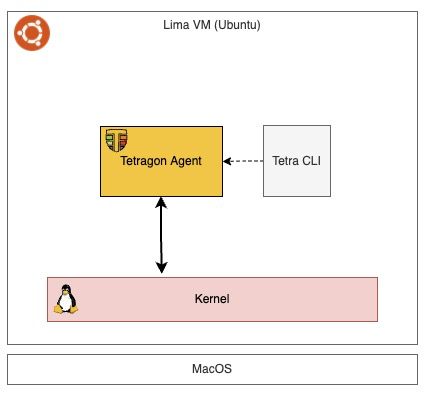
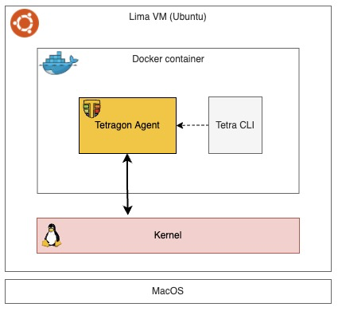
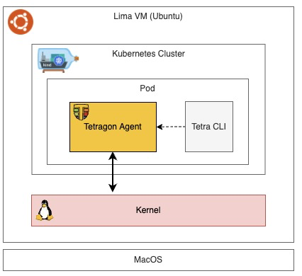

# Tetragon Develop environment on MacOS with lima

## Set up a Virtual Machine
- Create a Linux virtual machine on MacOS using [lima](https://github.com/lima-vm/lima)
- Two types of VM including qemu and vz are available. I choose qemu for stability. If you're interested in vz, please check [lima's document](https://lima-vm.io/docs/config/vmtype/#vz).
- Set up requirements according to [Tetragon: Development setup](https://tetragon.io/docs/contribution-guide/development-setup/)
- This setup has been tested on Apple M2 Max chip

### Install lima
```
brew install lima
```

### Download a template 
- Download a template from [my GitHub repository](https://github.com/yukinakanaka/tetragon-101)
```
wget https://github.com/yukinakanaka/tetragon-101/blob/main/lima/tetragon-dev.yaml
```
### Edit the template
- Edit cpu and memory configuration on the top of the template if required

default values:
```
cpus: 8
memory: "16GiB"
```

### Create a VM
- Create a VM with template
```
limactl start tetragon-dev.yaml
```

### Reboot the VM
- Reboot the VM so that [the docker group membership is re-valuated](https://docs.docker.com/engine/install/linux-postinstall/).
```
limactl stop tetragon-dev && limactl start tetragon-dev
```

### Check its setup
- Get shell
```
limactl shell tetragon-dev
```
- Print all information
```
uname -a
go version
kubectl version --client=true 
kind version
helm version --short
docker version
```

## Test the environment
> [!NOTE]  
> All commands need to be executed on the VM not on the host machine.

### Clone the Tetragon repository
```
git clone https://github.com/cilium/tetragon.git && cd tetragon
```
### Build everything
- Build
```
make
```

- Check some binaries
```
ls -la tetra*
```
The output should be similar to this:
```
-rwxr-xr-x 1 yukinakamura dialout 67043480 Apr 15 17:07 tetra
-rwxr-xr-x 1 yukinakamura dialout 70713496 Apr 15 17:07 tetragon
-rwxr-xr-x 1 yukinakamura dialout 68223128 Apr 15 17:13 tetragon-bench
```

### Run directly



- Run Tetragon agent
```
sudo ./tetragon --bpf-lib bpf/objs
```
The output should be similar to this:
```
...
time="2024-04-15T17:14:50+09:00" level=info msg="Perf ring buffer size (bytes)" percpu=68K total=544K
time="2024-04-15T17:14:50+09:00" level=info msg="Perf ring buffer events queue size (events)" size=63K
time="2024-04-15T17:14:50+09:00" level=info msg="Listening for events..."
```

- Open another shell and run the Tetragon gRPC client to get Tetragon events
```
./tetra getevents -o compact
```

- Open another shell and Run some commands
example:
```
uname -a 
Linux lima-tetragon-dev 5.15.0-101-generic #111-Ubuntu SMP Wed Mar 6 18:01:01 UTC 2024 aarch64 aarch64 aarch64 GNU/Linux
```
- Check Tetragon events
You can see the event of executed command!

The output should be similar to this:
```
🚀 process lima-tetragon-dev /usr/bin/uname -a                            
💥 exit    lima-tetragon-dev /usr/bin/uname -a 0
```

### Run in Docker



- Build image
```
make image
```
- Run the image in Docker
```
docker run --name tetragon \
   --rm -it -d --pid=host \
   --cgroupns=host --privileged \
   -v /sys/kernel/btf/vmlinux:/var/lib/tetragon/btf \
   cilium/tetragon:latest
```
- Run the Tetragon gRPC client to get Tetragon events
```
docker exec -it tetragon \
   bash -c "/usr/bin/tetra getevents -o compact" 
```
- Open another shell and Run some commands
example:
```
ps 
    PID TTY          TIME CMD
  60894 pts/2    00:00:00 bash
  60907 pts/2    00:00:00 ps
```
- Check Tetragon events
You can see the event of executed command!

The output should be similar to this:
```
🚀 process 09158fcd366b /usr/bin/ps                                       
💥 exit    09158fcd366b /usr/bin/ps  0  
```

- Stop the container
```
docker stop tetragon
```

### Run in Kubernetes (Kind)



#### Setup tetragon on kind
```
make kind-setup
```
The output should be similar to this:
```
...
Waiting for Tetragon deployment...
Waiting for daemon set "tetragon" rollout to finish: 0 of 1 updated pods are available...
daemon set "tetragon" successfully rolled out
```

#### Verify Tetragon is running
```
kubectl get pod -n kube-system | grep '^tetragon-\|^NAME'
```
The output should be similar to this:
```
NAME                                                 READY   STATUS    RESTARTS   AGE
tetragon-8f9cs                                       2/2     Running   0          17s
tetragon-operator-f8cb7f-hlzls                       1/1     Running   0          17s
```

#### Get Tetragon events
- Run the Tetragon gRPC client to get Tetragon events
```
kubectl exec -n kube-system ds/tetragon -c tetragon -- tetra getevents -o compact
```
- Open another shell and Run some commands
example:
```
id
uid=502(yukinakamura) gid=1000(yukinakamura) groups=1000(yukinakamura),999(docker)
```
- Check Tetragon events
You can see the event of executed command!
```
🚀 process tetragon-dev-control-plane /usr/bin/id 
💥 exit    tetragon-dev-control-plane /usr/bin/id  0
```

#### Appendix: Get all resources of Tetragon
Tetragon is installed via Helm and several resources are installed into Kubernetes. You can find all resources by following commands.
 
- Namespaced resources 
```
kubectl get -A -l helm.sh/chart=tetragon-1.0.0 \
"$(kubectl api-resources --namespaced=true --verbs=list -o name | tr "\n" "," | sed -e 's/,$//')"
```
The output should be similar to this:
```
NAMESPACE     NAME                                 DATA   AGE
kube-system   configmap/tetragon-config            22     6m5s
kube-system   configmap/tetragon-operator-config   4      6m5s

NAMESPACE     NAME                                  ENDPOINTS         AGE
kube-system   endpoints/tetragon                    172.18.0.2:2112   6m5s
kube-system   endpoints/tetragon-operator-metrics   10.244.0.5:2113   6m5s

NAMESPACE     NAME                                 READY   STATUS    RESTARTS   AGE
kube-system   pod/tetragon-8f9cs                   2/2     Running   0          6m5s
kube-system   pod/tetragon-operator-f8cb7f-hlzls   1/1     Running   0          6m5s

NAMESPACE     NAME                                               SECRETS   AGE
kube-system   serviceaccount/tetragon                            0         6m5s
kube-system   serviceaccount/tetragon-operator-service-account   0         6m5s

NAMESPACE     NAME                                TYPE        CLUSTER-IP     EXTERNAL-IP   PORT(S)    AGE
kube-system   service/tetragon                    ClusterIP   10.96.162.9    <none>        2112/TCP   6m5s
kube-system   service/tetragon-operator-metrics   ClusterIP   10.96.144.60   <none>        2113/TCP   6m5s

NAMESPACE     NAME                                          CONTROLLER                REVISION   AGE
kube-system   controllerrevision.apps/tetragon-7dbb6dd9b5   daemonset.apps/tetragon   1          6m5s

NAMESPACE     NAME                      DESIRED   CURRENT   READY   UP-TO-DATE   AVAILABLE   NODE SELECTOR   AGE
kube-system   daemonset.apps/tetragon   1         1         1       1            1           <none>          6m5s

NAMESPACE     NAME                                READY   UP-TO-DATE   AVAILABLE   AGE
kube-system   deployment.apps/tetragon-operator   1/1     1            1           6m5s

NAMESPACE     NAME                                       DESIRED   CURRENT   READY   AGE
kube-system   replicaset.apps/tetragon-operator-f8cb7f   1         1         1       6m5s

NAMESPACE     NAME                                                             ADDRESSTYPE   PORTS   ENDPOINTS    AGE
kube-system   endpointslice.discovery.k8s.io/tetragon-4vzb4                    IPv4          2112    172.18.0.2   6m5s
kube-system   endpointslice.discovery.k8s.io/tetragon-operator-metrics-6ns8z   IPv4          2113    10.244.0.5   6m5s
```
- Non-namespaced resources
```
kubectl get -A -l helm.sh/chart=tetragon-1.0.0 \
"$(kubectl api-resources --namespaced=false --verbs=list -o name | tr "\n" "," | sed -e 's/,$//')"
```
The output should be similar to this:
```
NAME                                                                         ROLE                            AGE
clusterrolebinding.rbac.authorization.k8s.io/tetragon                        ClusterRole/tetragon            6m23s
clusterrolebinding.rbac.authorization.k8s.io/tetragon-operator-rolebinding   ClusterRole/tetragon-operator   6m23s

NAME                                                      CREATED AT
clusterrole.rbac.authorization.k8s.io/tetragon            2024-04-15T08:21:08Z
clusterrole.rbac.authorization.k8s.io/tetragon-operator   2024-04-15T08:21:08Z
```
- CustomResourceDefinitions
```
kubectl get customresourcedefinitions
```

The output should be similar to this:
```
NAME                                  CREATED AT
tracingpolicies.cilium.io             2024-04-15T08:21:09Z
tracingpoliciesnamespaced.cilium.io   2024-04-15T08:21:10Z
```
